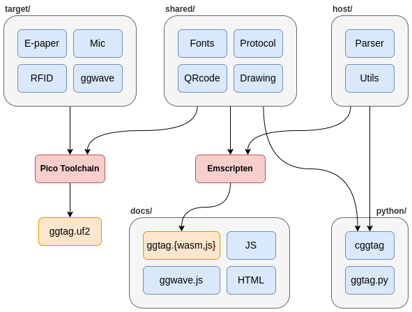

[](https://github.com/rgerganov/ggtag/actions)
# Overview

`ggtag` is an e-paper tag that can be programmed with sound using the [ggwave](https://github.com/ggerganov/ggwave) library.
It is based on the RP2040 microcontroller and has 3.52" e-paper display.
Additionally, ggtag supports USB serial programming and allows emulation of 125kHz RFID tags (ASK and FSK).

[](https://www.crowdsupply.com/eurolan-ltd/ggtag) 

__The GGtag's CrowdSupply campaign has started, you can order one [here](https://www.crowdsupply.com/eurolan-ltd/ggtag)!__

<table>
  <tr>
    <td>
      
    </td>
    <td>
      </img>
    </td>
  </tr>
</table>

Some example tags:
 * [demo](https://ggtag.io/?i=%5Cr18%2C15%2C82%2C82%5Cq22%2C19%2C3%2Chttps%3A%2F%2Fggtag.io%5CI273%2C15%2C70%2C70%2C0%2Chttps%3A%2F%2Fggtag.io%2Fggtag-180x180.png%5Ct139%2C118%2C5%2Cggtag%5Ct58%2C149%2C3%2Cprogrammable%20e-paper%20tag%5Ca58%2C200%2C20%2Clink%5Ct86%2C203%2C4%2Chttps%3A%2F%2Fggtag.io)
 * [octocat](https://ggtag.io/?i=%5Cr10%2C25%2C110%2C110%5CI15%2C30%2C100%2C100%2C0%2Chttps%3A%2F%2Favatars.githubusercontent.com%2Fu%2F583231%5Ct140%2C50%2C5%2CThe%20Octocat%5Ct140%2C80%2C2%2Cgithub.com%2Foctocat%5Ca13%2C156%2C16%2Cmap-marker-alt%5Ct33%2C158%2C2%2CSan%20Francisco%5Ca13%2C183%2C16%2Cbuilding%5Ct33%2C185%2C2%2C%40github%5Ca180%2C154%2C16%2Clink%5Ct202%2C158%2C2%2Chttps%3A%2F%2Fgithub.blog%5Ca180%2C185%2C16%2Cenvelope%5Ct202%2C185%2C2%2Coctocat%40github.com)
 * [mario](https://ggtag.io/?i=%5CI17%2C19%2C0%2C0%2C0%2Chttps%3A%2F%2Fggtag.io%2Fmario.png%5Ct144%2C42%2C5%2CSUPER%20MARIO%5Ct146%2C75%2C4%2Cplumber%5Ca30%2C165%2C23%2Cphone-alt%5Ct68%2C168%2C3%2C08812345%5Ca30%2C208%2C23%2Cenvelope%5Ct68%2C210%2C3%2Cm%40ggtag.io%5Ca215%2C165%2C23%2Cglobe%5Ct248%2C167%2C3%2Cggtag.io%5Ca217%2C203%2C23%2Cmap-marker-alt%5Ct248%2C208%2C3%2CSofia)
 * [wifi](https://ggtag.io/?i=%5Ca40%2C35%2C75%2Cwifi%5Cq215%2C30%2C3%2CWIFI%3AS%3AHotel%20WiFi%3BT%3AWPA%3BP%3A12345678%3B%3B%5Ct40%2C155%2C5%2CSSID%3A%20Hotel%20WiFi%5Ct40%2C185%2C5%2C%20PWD%3A%2012345678)

Both firmware and hardware are open source and licensed under the GPLv3 license.
The PCB is made by [Eurolan](http://www.eurolan.net/), you can find more details about the hardware design in the [hardware](/hardware) directory.

# Usage

`ggtag` can be programmed either with sound or with USB serial.
To program with sound, you need to put a CR2032 battery in the battery holder and flip the switch to the `BATT` position.
To program with USB serial, you need to connect `ggtag` to a USB host and flip the switch to the `USB` position.
Both programming modes are supported in the web interface hosted at [ggtag.io](https://ggtag.io), all you need is a modern HTML browser.

## Programming with sound

Here is a demonstration of how programming with sound works. Initially, three ggtags are listening and then programmed simultaneously using mobile phone.
After the initial programming, you need to press the button on the side for ggtag to start listening again. At the end make sure to flip the switch back to `USB` position in order to preserve the battery.

https://user-images.githubusercontent.com/271616/233822561-fff766fd-9242-4774-a4a4-4f87c363f370.mp4

## Programming with USB serial

The web interface is using [Web Serial API](https://developer.mozilla.org/en-US/docs/Web/API/Web_Serial_API) for USB serial programming, so you need a web browser (e.g. Chrome, Edge) which supports this API. Mobile Chrome running on Android is also supported. Here is a demo of using Pixel5 phone for USB serial programming:

https://github.com/rgerganov/ggtag/assets/271616/d471cdec-4e41-4382-ae9f-f745ea71745e

## Emulating RFID tags

You can emulate 125kHz RFID tags with ggtag. This is accomplished with an ATtiny85 MCU and the [avrfid](https://github.com/scanlime/navi-misc/blob/master/avrfid/avrfid.S) firmware. When ggtag receives an RFID command, it generates the corresponding avrfid firmware and programs the ATtiny85 with it. Demo with Flipper Zero:

https://github.com/rgerganov/ggtag/assets/271616/654c1e1a-a8cb-4189-a39e-80669b1f9637

Another demo with USB RFID reader:

https://github.com/rgerganov/ggtag/assets/271616/f1d7bd59-880e-44ea-8732-c919e1119cd3

## Web receiver

There is a web audio receiver which implements the [ggtag protocol](https://github.com/rgerganov/ggtag/blob/master/protocol.md) running at [https://ggtag.io/recv/](https://ggtag.io/recv/).
This could be useful if you want to hack on the protocol and debug stuff directly in the browser.

https://github.com/rgerganov/ggtag/assets/271616/a54e0393-90e2-4561-994b-85e5b82250ba

## Python examples

There is a `ggtag` python package which can be used together with `pyserial` or `ggwave` to program the device. See the [examples](examples/) folder for more details.

# Known issues

 * If you switch off the battery after successful sound programming, you need to make ~5sec pause before switching it on again.
 * With some RFID readers you need to keep `ggtag` at 1cm distance for read to be successful.
 * If you want to display non-ASCII text, you need to convert it to image first.

# Credits

* [ggwave](https://github.com/ggerganov/ggwave) (MIT license)
* [microphone-library-for-pico](https://github.com/ArmDeveloperEcosystem/microphone-library-for-pico/) (Apache 2.0 license)
* [Pico_ePaper_Code](https://github.com/waveshare/Pico_ePaper_Code) (GPLv3 license)
* [QR-Code-generator](https://github.com/nayuki/QR-Code-generator) (MIT license)
* [Serial API Polyfill](https://github.com/google/web-serial-polyfill) (Apache 2.0 license)
* [avrfid](https://github.com/scanlime/navi-misc/blob/master/avrfid/avrfid.S) (BSD license)
* [stb_truetype](https://github.com/nothings/stb/blob/master/stb_truetype.h) (MIT license)
* [Font Awesome](https://fontawesome.com/) (CC BY 3.0 license)

# Project structure

The codebase is structured in the following way:
 * `target` - contains device only source code
 * `shared` - contains shared source code between the device and the host library
 * `host` - contains the host library
 * `docs` - contains the web interface
 * `python` - contains Python bindings for the host library
 * `examples` - contains some examples
 * `hardware` - contains hardware design files

## Component diagram



## Building the firmware

Follow these steps to build the RP2040 firmware:

```
git clone https://github.com/raspberrypi/pico-sdk
cd pico-sdk
git submodule init
git submodule update
cd ..
git clone https://github.com/raspberrypi/pico-extras
cd pico-extra
git submodule init
git submodule update
cd ..
export PICO_SDK_PATH=<full_path_to_pico_sdk>
export PICO_EXTRAS_PATH=<full_path_to_pico_extras>
export PICO_TOOLCHAIN_PATH=<full_path_to_arm_toolchain>

git clone git@github.com:rgerganov/ggtag
cd ggtag
git submodule init
git submodule update
mkdir build
cd build
cmake .. -DPICO_BOARD=pico
make
```

## Building the web interface

The host library is compiled to WASM using [Emscripten](https://emscripten.org/):
```
source <path_to_emsdk_env.sh>
CXX=emcc make
```
You can start a local server with `make server` and access the web interface at [http://localhost:8000](http://localhost:8000).
There is a hosted version available at [https://ggtag.io](https://ggtag.io)

## Flashing the firmware

Put ggtag into USB mode, press and hold the button and plug the USB cable.
Download the latest firmware [release](https://github.com/rgerganov/ggtag/releases) and copy the `.uf2` file to the `RPI-RP2` drive.
The tag will reboot and run the new firmware.

# Feedback

We'd love to hear your feedback, comments and questions about ggtag in the [Project Discussions](https://github.com/rgerganov/ggtag/discussions)
